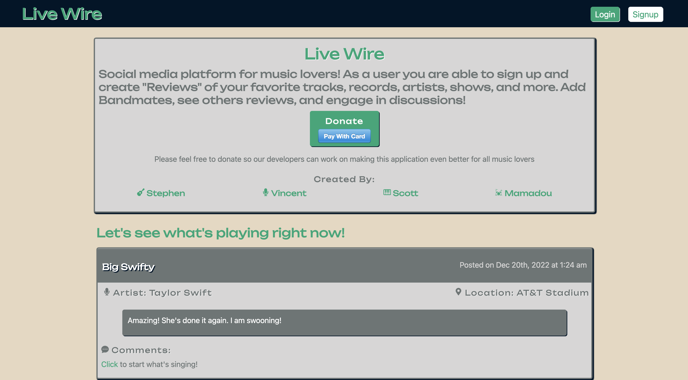

# Live Wire

## License
### 
### [MIT](https://opensource.org/licenses/MIT)

## Description

* This application is a social media platform where people can review their thoughts and experiences while attending a concert or listening to their favorite album. We built this application to exercise our knowledge of ReactJs while framing it in something else we love, music. Live Wire is a MERN stack application that uses GraphQl, MongoDb and React.

## USER STORY

* As a music lover
* I WANT an app to share my thoughts on artists I enjoy, shows i've attended, or genres in general.
* SO THAT i can engage with others online and find new cool stuff to listen to. 

## Table of Contents

* [USER STORY](#user-story)

* [Live Deployment](#live-deployment)

* [Installation](#installation)

* [Tests](#tests)

* [Usage](#usage)  

* [Contributors](#contributors)

* [Future Developments](#future-developments)

* [Questions?](#questions)

## Live Deployment

[Live Wire Live Deployment Link](https://secure-shore-15914.herokuapp.com/)

## Installation

* Head to the repository to download, clone or view this code: [Github: Live Wire](https://github.com/stephen-kern/Live-Wire)

* Run `npm init` in the root of the project, client, and server. 
* Run `npm run develop` to fire up the application. 
* See client & server package.json's for individual running.

## Tests

Video Demonstration Here

## Usage

* Users can Signup for their account by entering their Username, Email (with rubular protection) and Password (protected by secrets)
- Users can use this info later to log back in and pick up where they left off

* Can view posts by all users and see Artist, Location and their Reviews.

* When clicking on comments, will be redirected to a Single Review page where the user can leave a comment and see other comments.

* Users can view other users profiles through multiple different Links

* On the profile, the users name, count of Bandmates (friends) and all posts are displayed

* If you click on Bandmates, you can see the users Bandmates List (friends list)

* If on another users page, you have the ability to add them as a bandmate (similar to follow function)

* Live Wire title leads to the developer mission, which a donation link and links to the creators githubs.
- This mission is also displayed before the user logs in

## Contributors

* [Mamadou Yaya Diallo](https://github.com/mamadou1991)
* [Scott Rinaberger](https://github.com/Rinaberger)  
* [Stephen Kern](https://github.com/stephen-kern) 
* [Vincent Toon](https://github.com/Vincenttoon)

### Future Developments

* Add Likes and Dislikes for individual Reviews

* Add Likes and Dislikes for individual Comments

* Add functionality to remove Bandmates (back-end is functional)

* Add functionality to remove Reviews (back-end is functional)

* Add Titles to Reviews

* Have ability for users to upload profile pictures

* Make toggle choices for users if they are posting from Home or On the Road (Mobile, no venue)

## Questions?

Questions, comments, or concerns? Please Email us at:
* vincenttoon22@gmail.com
* Stephenkern96@gmail.com